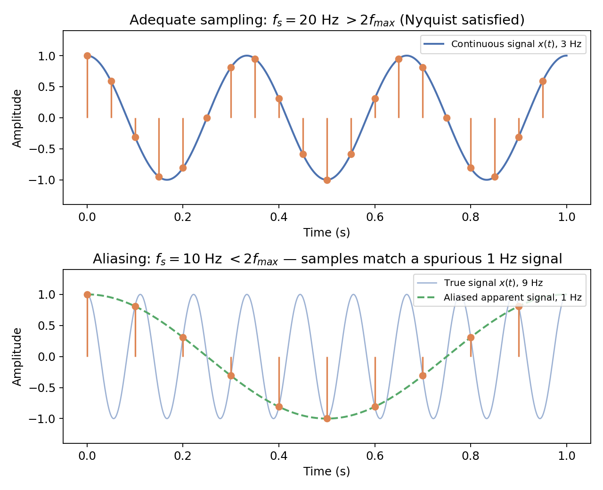
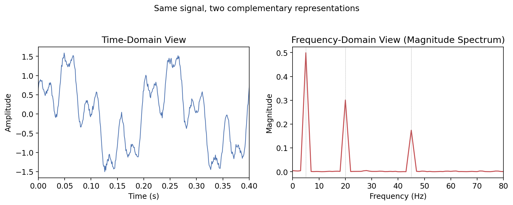
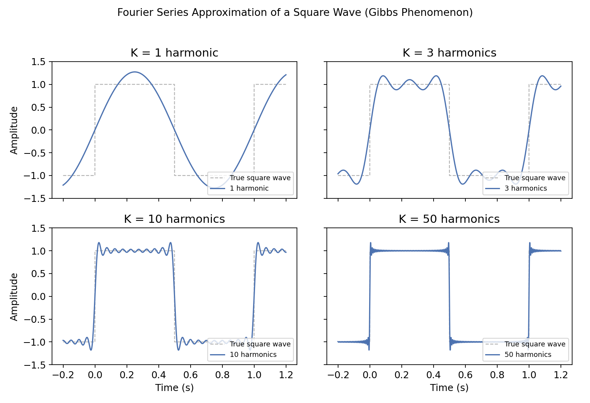
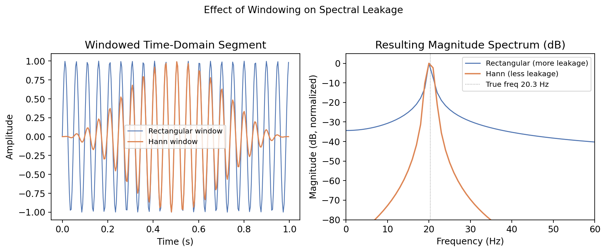
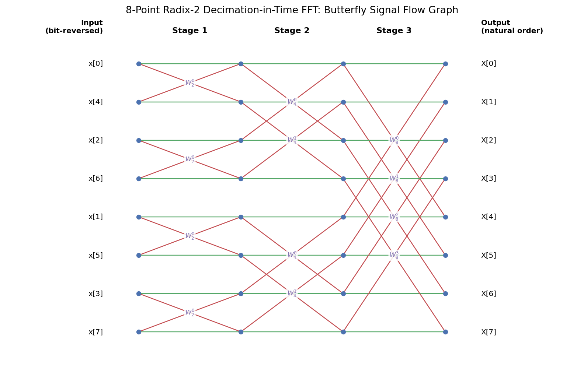
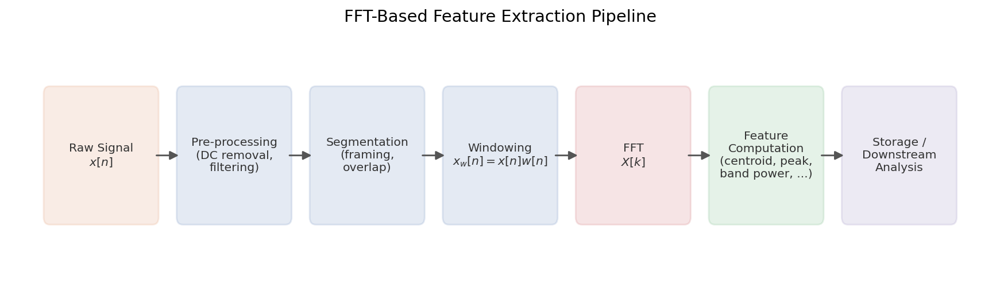

# Digital Signal Processing

## Introduction to Digital Signal Processing

### What Is a Signal?

A signal is any physical quantity that varies with respect to an independent variable — most commonly time — and that carries information about the behavior or state of a system. Signals surround nearly every domain of science and engineering: the voltage output of a microphone as sound pressure varies, the light intensity captured by a camera sensor, the voltage recorded by an electrode placed on the scalp during an EEG study, the vibration measured by an accelerometer bolted to a rotating machine, or the price of a financial instrument recorded once per minute. In each case, the signal is a function $x(t)$ (continuous time) or $x[n]$ (discrete time, sample index $n$) that encodes information the observer wants to extract, interpret, or act upon.

Digital Signal Processing (DSP) is the field concerned with representing such signals numerically and applying mathematical operations — algorithms — to extract information from them, transform them, compress them, or otherwise manipulate them, using digital computation rather than continuous analog circuitry.

### From Analog to Digital: A Historical Perspective

For most of the twentieth century, signal processing was performed by analog means: networks of resistors, capacitors, inductors, vacuum tubes, and later transistors and operational amplifiers, arranged so that a desired mathematical operation (filtering, amplification, modulation) emerged from the physics of the circuit. Analog processing has genuine strengths — it can operate with very low latency, at very high bandwidths, and often at very low power for simple operations — and it remains essential in the "front end" of nearly every measurement system, where physical quantities must first be transduced into electrical form and conditioned before digitization.

However, analog circuits suffer from several fundamental limitations. Component values drift with temperature, age, humidity, and manufacturing tolerance, so two "identical" analog filters built from the same schematic will not behave identically. Analog processing is inflexible: to change the behavior of an analog filter, the physical circuit itself typically must be redesigned. And analog systems are difficult to scale in precision — achieving very high dynamic range or very sharp filter characteristics in the analog domain often requires exotic, expensive, or physically large components.

The development of practical digital computers in the mid-twentieth century, followed by the theoretical breakthroughs described later in this chapter (particularly the Fast Fourier Transform, published by Cooley and Tukey in 1965), triggered a decades-long shift toward digital signal processing as the dominant paradigm. By the late twentieth century, dedicated digital signal processors (DSPs), and later general-purpose CPUs, GPUs, and FPGAs, had become fast enough and cheap enough to perform sophisticated signal processing operations in real time, for applications ranging from mobile telephony to medical imaging to consumer audio.

### Why Digital? The Core Advantages

Several properties make digital representation and processing of signals advantageous over purely analog approaches:

* **Reproducibility and stability:** A digital algorithm, expressed as a sequence of arithmetic operations on numbers, produces bit-for-bit identical results every time it is executed on the same input, on the same class of hardware. There is no drift, no aging, no dependence on the ambient temperature of a resistor.
* **Flexibility and reconfigurability:** Because digital processing is implemented in software (or reconfigurable digital hardware), the behavior of a digital filter, transform, or detection algorithm can be changed by modifying code or coefficients, without any change to the physical hardware. A single piece of digital hardware can be repurposed for entirely different processing tasks.
* **Precision and dynamic range:** The precision of digital processing is limited only by the number of bits used to represent each sample and by the arithmetic used in computation (fixed-point or floating-point). Modern systems routinely use 16-, 24-, or 32-bit representations, and floating-point arithmetic, giving dynamic ranges and precision far exceeding what is practical with analog components alone.
* **Storage, transmission, and integration with computation:** Once a signal exists as a sequence of numbers, it can be losslessly stored on digital media, transmitted over digital communication channels with error correction, compressed using well-understood algorithms, and — critically for modern applications — combined directly with statistical analysis, databases, and machine learning models. This last point is central to the motivation for this work: once signals are digitized and their salient characteristics extracted, they become first-class data that can be indexed, searched, and analyzed at scale.
* **Design tools and mathematical maturity:** Digital filter and transform design benefits from a mature, well-understood body of mathematics (much of which is developed in this chapter), together with software tools that allow a desired frequency response or processing behavior to be specified precisely and then realized algorithmically, with predictable, analyzable behavior.

### The General DSP Pipeline

Despite the enormous diversity of DSP applications, most digital signal processing systems share a common high-level structure:

$$
x(t) \;\xrightarrow{\text{Sensor / Transducer}}\; x_a(t) \;\xrightarrow{\text{Anti-Aliasing Filter}}\; x_f(t) \;\xrightarrow{\text{ADC (Sampling + Quantization)}}\; x[n] \;\xrightarrow{\text{Digital Processing}}\; y[n]
$$

A physical phenomenon $x(t)$ is first converted into an electrical analog signal $x_a(t)$ by a transducer (a microphone, accelerometer, photodiode, electrode, etc.). This analog signal is conditioned — amplified, and critically, low-pass filtered to remove frequency content that would otherwise corrupt the digitization process (see Section 3.2) — before being converted into a discrete-time, discrete-amplitude sequence $x[n]$ by an analog-to-digital converter (ADC). From this point onward, all further manipulation — filtering, transformation, feature extraction, storage, analysis — happens numerically, on the sequence $x[n]$, using the algorithms developed throughout the remainder of this chapter.

In some systems, particularly those involving actuation or synthesis (e.g., audio playback, motor control), a complementary path exists in which a digitally generated or processed sequence $y[n]$ is converted back into a continuous analog signal $y(t)$ by a digital-to-analog converter (DAC), typically followed by a reconstruction (smoothing) filter. This work is primarily concerned with the *analysis* direction — converting real-world signals into digital form and extracting meaningful information from them — rather than synthesis, so the DAC/reconstruction path is mentioned here for completeness but is not developed further.

### Application Domains

The breadth of DSP's application is difficult to overstate. A partial survey includes:

* **Telecommunications**, where DSP underlies modulation and demodulation, channel equalization, error detection and correction, and the compression schemes that make efficient use of limited bandwidth.
* **Audio and speech processing**, including noise reduction, echo cancellation, audio compression (e.g., MP3, AAC), speech recognition front-ends, and music information retrieval.
* **Image and video processing**, where two-dimensional analogues of the techniques in this chapter underlie compression (JPEG, video codecs), filtering, and computer vision pipelines.
* **Radar, sonar, and remote sensing**, where frequency-domain analysis is used to detect targets, estimate distance and velocity (via Doppler shift), and characterize environments.
* **Biomedical signal processing**, including analysis of ECG, EEG, EMG, and other physiological signals for diagnosis and monitoring.
* **Industrial and mechanical condition monitoring**, where vibration and acoustic signals from rotating machinery are analyzed in the frequency domain to detect bearing faults, imbalance, misalignment, and other failure modes long before they would be apparent from raw time-domain inspection.
* **Financial and general time-series analysis**, where periodicity detection, trend extraction, and anomaly detection borrow directly from classical DSP tools.

The techniques developed in the remainder of this chapter — sampling theory, time- and frequency-domain analysis, the Fourier series and transform, the Discrete Fourier Transform, and the Fast Fourier Transform — are not specific to any one of these domains. They are the common mathematical and algorithmic substrate underlying essentially all of them, which is precisely why a solid grounding in these fundamentals is prerequisite to any specific application, including the one developed later in this work.

## Signal Fundamentals

### Mathematical Definition and Notation

Formally, a signal is a function that maps values of an independent variable — typically time, but in principle any ordering variable such as spatial position — to a dependent variable representing the physical or abstract quantity of interest. Throughout this chapter, continuous-time signals are written $x(t)$, with $t \in \mathbb{R}$, and discrete-time signals are written $x[n]$, with $n \in \mathbb{Z}$, using square brackets to distinguish a sequence indexed by an integer from a function of a continuous variable. This notational convention, standard throughout the DSP literature, is used consistently for the remainder of this work.

A signal may be **real-valued**, taking values in $\mathbb{R}$, as is the case for essentially all physically measured signals (voltages, pressures, displacements), or **complex-valued**, taking values in $\mathbb{C}$, which arises naturally in the mathematical machinery of frequency-domain analysis even when the underlying physical signal is real.

### Classification of Signals

Signals are classified along several independent axes, and understanding these classifications is prerequisite to selecting appropriate analysis tools.

* **Continuous-time versus discrete-time:** A continuous-time signal $x(t)$ is defined for every real value of $t$ within its domain. A discrete-time signal $x[n]$ is defined only at a discrete, typically evenly spaced, set of index values. Discrete-time signals commonly (though not exclusively) arise from sampling a continuous-time signal, as described in Section 3.
* **Continuous-valued versus discrete-valued (quantized) amplitude:** Independently of whether the time axis is continuous or discrete, the *amplitude* of a signal may be continuous-valued (able to take any real value) or discrete-valued (restricted to a finite set of levels). A signal that is discrete in both time and amplitude is termed a **digital signal**; this is the form required for representation and processing on a digital computer. A signal continuous in both time and amplitude is an **analog signal**. The intermediate case — continuous amplitude, discrete time — is sometimes called a **sampled-data** signal, and is a useful conceptual stepping stone in the derivation of the sampling theorem (Section 3).
* **Deterministic versus random (stochastic) signals:** A deterministic signal can be described exactly by an explicit mathematical expression or a known rule, so that its value at any time (past, present, or future) can be computed exactly — for example, $x(t) = A\sin(2\pi f_0 t + \phi)$. A random signal, such as thermal noise in an electronic circuit, cannot be predicted exactly; it can only be characterized statistically, through quantities such as its mean, variance, probability distribution, autocorrelation function, and power spectral density. Nearly all real-world measured signals contain some random component (noise), superimposed on an underlying deterministic or quasi-deterministic structure of interest.
* **Periodic versus aperiodic signals:** A continuous-time signal $x(t)$ is periodic if there exists a positive real number $T$, called the period, such that

    $$
    x(t + T) = x(t) \quad \text{for all } t.
    $$

The smallest such $T$ is called the **fundamental period**, and its reciprocal $f_0 = 1/T$ is the **fundamental frequency**. If no finite $T$ satisfies this relationship, the signal is aperiodic. An analogous definition applies in discrete time, with the added subtlety that a discrete-time sinusoid is periodic only if its frequency is a rational multiple of the sampling frequency — a point that will recur when discussing the discrete Fourier basis in Section 8.
* **Even versus odd symmetry:** A signal is **even** if $x(-t) = x(t)$, and **odd** if $x(-t) = -x(t)$. Any signal can be decomposed uniquely into the sum of an even and an odd component. This decomposition is relevant later because it determines which terms (cosine versus sine, real versus imaginary) appear in a signal's Fourier representation.
* **Energy signals versus power signals.** The total energy of a continuous-time signal is defined as
$$
E = \int_{-\infty}^{\infty} |x(t)|^2 \, dt,
$$
and its average power as
$$
P = \lim_{T \to \infty} \frac{1}{T}\int_{-T/2}^{T/2} |x(t)|^2\, dt.
$$
A signal is classified as an **energy signal** if $0 < E < \infty$ (which implies $P = 0$) — this describes signals that are, loosely speaking, transient or decaying, such as a single pulse. A signal is classified as a **power signal** if $E = \infty$ but $0 < P < \infty$ — this describes signals that persist indefinitely with finite average power, such as periodic signals or stationary random noise. This distinction matters because different mathematical tools are naturally suited to each class: the Fourier transform is most naturally applied to energy signals, while power signals (including periodic signals) require either the Fourier series or, for the transform to apply at all, the introduction of generalized functions (impulses) in the frequency domain.

### Elementary Signals

A small set of idealized signals recur throughout DSP theory, both because they model useful physical situations and because more complex signals can be constructed from them.

* **The discrete-time unit impulse**, or Kronecker delta, is defined as
$$
\delta[n] = \begin{cases} 1, & n = 0 \\ 0, & n \neq 0. \end{cases}
$$
Its significance extends far beyond its simple definition: *any* discrete-time sequence $x[n]$ can be expressed as a weighted sum of shifted impulses,
$$
x[n] = \sum_{k=-\infty}^{\infty} x[k]\, \delta[n-k],
$$
which is the discrete-time **sifting property**. This decomposition underlies the derivation of the convolution sum, since it allows the response of a linear system to an arbitrary input to be built up from its response to a single impulse.
* **The unit step function** is defined as

    $$
    u[n] = \begin{cases} 1, & n \geq 0 \\ 0, & n < 0, \end{cases}
    $$

commonly used to model signals that "switch on" at a given instant, and useful for constructing other signals such as finite-duration pulses via differences of shifted steps.
* **The complex exponential** $x[n] = A e^{j\omega n}$, where $j = \sqrt{-1}$, $A$ is a (possibly complex) amplitude, and $\omega$ is angular frequency in radians per sample, occupies a uniquely important role in DSP. By Euler's formula,

    $$
    e^{j\omega n} = \cos(\omega n) + j\sin(\omega n),
    $$

so the complex exponential simultaneously encodes a cosine and a sine component. Its importance stems from the fact that complex exponentials are **eigenfunctions of linear time-invariant systems**: passing $e^{j\omega n}$ through an LTI system (Section 2.4) produces an output that is the same complex exponential, scaled by a complex constant. This single property is what makes frequency-domain analysis — decomposing arbitrary signals into sums of complex exponentials — so powerful for analyzing the behavior of LTI systems, and it is the conceptual seed from which the Fourier series, Fourier transform, and DFT all grow.
* **The real sinusoid** $x(t) = A\cos(2\pi f t + \phi)$ is the continuous-time signal most directly associated with a "single frequency," characterized by three parameters: amplitude $A$, frequency $f$ (in Hz), and phase $\phi$ (in radians). Every periodic signal, however complex its shape, can be expressed as a sum of sinusoids of this form at different frequencies, amplitudes, and phases.

### Systems and the Central Role of LTI Systems

A **system**, in the DSP sense, is any well-defined operation, or operator $T\{\cdot\}$, that transforms an input signal into an output signal: $y[n] = T\{x[n]\}$. Filters, transforms, and virtually every processing block in a DSP pipeline can be described as a system in this sense.

Two properties, when possessed together, define the extremely important class of **Linear Time-Invariant (LTI) systems**:

* **Linearity:** A system is linear if it obeys the superposition principle: for any two inputs $x_1[n]$ and $x_2[n]$ and any scalars $a, b$,
$$
T\{a\,x_1[n] + b\,x_2[n]\} = a\,T\{x_1[n]\} + b\,T\{x_2[n]\}.
$$
* **Time-invariance:** A system is time-invariant if a shift in the input produces an identical shift in the output, with no other change: if $y[n] = T\{x[n]\}$, then for any integer shift $n_0$,
$$
T\{x[n-n_0]\} = y[n-n_0].
$$

The importance of the LTI class lies in a remarkable consequence of these two properties, combined with the sifting property from Section 2.3: an LTI system is **completely characterized** by its response to a single impulse, called the **impulse response** $h[n] = T\{\delta[n]\}$. Given $h[n]$, the output of the system for *any* input $x[n]$ can be computed via the **convolution sum**:
$$
y[n] = x[n] * h[n] \;=\; \sum_{k=-\infty}^{\infty} x[k]\, h[n-k].
$$
This result follows directly from linearity and time-invariance applied to the impulse decomposition of $x[n]$ given that since $x[n]$ is a sum of scaled, shifted impulses, and the system is linear and time-invariant, the output must be the corresponding sum of scaled, shifted impulse responses.

Convolution is the mathematical operation underlying digital filtering, and it has a particularly elegant relationship to the Fourier transform: convolution in the time domain corresponds to simple multiplication in the frequency domain. This equivalence is one of the most consequential results in all of signal processing, since it means that a computationally expensive convolution can, in many cases, be performed more efficiently by transforming to the frequency domain, multiplying, and transforming back — a strategy made practical by the Fast Fourier Transform.

An LTI system is further classified as **stable** if every bounded input produces a bounded output (BIBO stability), and as **causal** if the output at any time depends only on present and past input values, never future ones — a requirement for any system operating in real time on live data. Both properties depend directly on characteristics of the impulse response $h[n]$, and are central considerations in the design of the digital filters.

## Sampling and Analog-to-Digital Conversion

### Overview of the Conversion Process

Before any real-world signal can be processed digitally, it must be converted from a continuous-time, continuous-amplitude analog signal into a discrete-time, discrete-amplitude digital sequence. This conversion, performed by an **analog-to-digital converter (ADC)**, consists of two conceptually distinct operations: **sampling**, which discretizes the time axis by recording the signal's value only at specific instants, and **quantization**, which discretizes the amplitude axis by rounding each recorded value to the nearest of a finite set of representable levels. These two operations are typically performed together by a single physical device, but they introduce distinct and separately analyzable forms of error and information loss, and are treated separately below.

### Sampling

Sampling takes a continuous-time signal $x(t)$ and produces a discrete-time sequence by evaluating it at regular intervals of $T_s$ seconds, called the **sampling period**:
$$
x[n] = x(nT_s), n = 0, 1, 2, \dots
$$

The reciprocal of the sampling period is the **sampling frequency** or **sampling rate**, $f_s = 1/T_s$, expressed in samples per second, or hertz (Hz). Common sampling rates encountered in practice include 44.1 kHz (CD-quality audio), 48 kHz (professional audio and video), 8 kHz (traditional telephony), and rates ranging from a few hundred Hz to hundreds of kHz or beyond in industrial and scientific instrumentation, depending on the bandwidth of the phenomenon being measured.

Mathematically, ideal sampling can be modeled as multiplying the continuous-time signal $x(t)$ by an infinite train of unit impulses spaced $T_s$ apart:
$$
x_s(t) = x(t)\sum_{n=-\infty}^{\infty}\delta(t - nT_s)
$$
This model, while a mathematical idealization (no real ADC samples with an infinitely narrow aperture), is extremely useful because it allows the effect of sampling on a signal's frequency content to be derived cleanly using the Fourier transform: the spectrum of the impulse-sampled signal $x_s(t)$ turns out to be the original spectrum $X(f)$, replicated periodically at every integer multiple of $f_s$:
$$
X_s(f) = \frac{1}{T_s}\sum_{k=-\infty}^{\infty} X(f - kf_s).
$$
This replication result is the mathematical heart of sampling theory, and it directly explains both the possibility of perfect reconstruction under the right conditions, and the failure mode known as aliasing, described next.

### The Nyquist–Shannon Sampling Theorem

The spectral replication result above shows that sampling creates a copy of the original spectrum $X(f)$ centered at every multiple of $f_s$. If the original signal is **band-limited** — meaning $X(f) = 0$ for all $|f| > f_{max}$, for some finite $f_{max}$ — then these replicated copies will not overlap, *provided the spacing between them, $f_s$, is large enough*. Specifically, the copies remain non-overlapping if and only if:
$$
f_s > 2f_{max}.
$$
This is the celebrated **Nyquist–Shannon sampling theorem**: a band-limited signal with maximum frequency component $f_{max}$ can be perfectly reconstructed from its samples, provided it is sampled at a rate exceeding twice its bandwidth. The threshold quantity $2f_{max}$ is called the **Nyquist rate** — the minimum sampling rate required for the signal in question — and, for a given sampling rate $f_s$, the quantity $f_s/2$ is called the **Nyquist frequency**: the highest frequency that can be unambiguously represented at that sampling rate.

When the non-overlap condition holds, the original continuous-time signal can, in principle, be exactly recovered from its samples by an ideal low-pass (reconstruction) filter that isolates the central, unreplicated copy of the spectrum and removes all the higher-frequency replicas — a result formalized by the **Whittaker–Shannon interpolation formula**,
$$
x(t) = \sum_{n=-\infty}^{\infty} x[n]\,\operatorname{sinc}\!\left(\frac{t - nT_s}{T_s}\right)
$$

$$
\operatorname{sinc}(u) = \frac{\sin(\pi u)}{\pi u}.
$$
While this ideal reconstruction is not exactly achievable in practice (it requires a non-causal, infinitely long filter), it provides the theoretical benchmark against which practical reconstruction and interpolation methods are measured.

### Aliasing

If the sampling condition $f_s > 2f_{max}$ is violated — that is, if the signal contains frequency content above the Nyquist frequency $f_s/2$ — the replicated spectral copies described in Section 3.2 **overlap**. Where they overlap, high-frequency content folds down and superimposes on lower-frequency content, an effect called **aliasing**. Once aliasing has occurred, the corruption is irreversible: the resulting samples are indistinguishable from samples that would have been produced by a genuinely different, lower-frequency signal. No amount of downstream digital processing can undo this — the information about the true, higher frequency has been permanently and ambiguously mixed with the lower-frequency content.

A frequency component at $f_0 > f_s/2$ will appear, after sampling, as a spurious component at the **aliased frequency**
$$
f_{alias} = \left| f_0 - k f_s \right|,
$$
where $k$ is the integer chosen so that $f_{alias}$ falls within $[0, f_s/2]$. A commonly cited intuitive example is the "wagon-wheel effect" seen in film and video: a wheel's spokes, rotating faster than half the frame rate, appear to rotate slowly, or even backward, because the discrete frame samples alias the true high rotational frequency down to a spurious low (or negative) apparent frequency.

Because aliasing is unrecoverable once it has occurred, it must be prevented *before* sampling, not corrected afterward. This is accomplished with an **anti-aliasing filter**: an analog low-pass filter placed before the ADC, with a cutoff frequency at or below the Nyquist frequency $f_s/2$, that attenuates any signal content above this frequency to a level low enough that residual aliasing is negligible for the application at hand. Because no physical filter has an infinitely sharp cutoff, practical systems typically sample somewhat faster than the strict Nyquist minimum (**oversampling**) to give the anti-aliasing filter a realistic transition band in which to roll off.

### Quantization

Sampling alone converts a signal's *time axis* from continuous to discrete, but each sample $x[n] = x(nT_s)$ still, in principle, carries a continuous (real-valued) amplitude. To represent this value digitally, using a finite number of bits, it must be rounded to one of a finite set of representable levels — a process called **quantization**.

A uniform quantizer with $B$ bits divides the signal's amplitude range into $2^B$ discrete levels, spaced by a **step size**
$$
\Delta = \frac{x_{max} - x_{min}}{2^B}.
$$
Each true sample value is replaced by the nearest representable level, $\hat{x}[n]$, and the difference between the true and quantized value is the **quantization error**:
$$
e[n] = x[n] - \hat{x}[n].
$$
For a well-behaved (sufficiently "busy") signal relative to the step size, this error is well-approximated as a random variable uniformly distributed over the interval $[-\Delta/2, \Delta/2]$, with zero mean and variance
$$
\sigma_e^2 = \frac{\Delta^2}{12}.
$$
Treating quantization error as an additive noise source, uncorrelated with the signal, allows the definition of the **signal-to-quantization-noise ratio (SQNR)**. For a full-scale sinusoidal input, this analysis yields the widely quoted approximate relationship
$$
\text{SQNR (dB)} \approx 6.02\,B + 1.76,
$$
which shows that each additional bit of amplitude resolution improves the achievable signal-to-noise ratio by approximately 6 dB. This relationship explains, for example, why 16-bit audio (roughly 98 dB SQNR) is dramatically cleaner than 8-bit audio (roughly 50 dB SQNR), and why applications demanding very high dynamic range (e.g., scientific instrumentation, professional audio) often use 24-bit or floating-point representations.

### Practical ADC Characteristics and Trade-offs

Beyond the idealized sampling-rate and bit-depth analysis above, real ADCs are subject to a number of practical non-idealities that a system designer must account for:

* **Jitter:** small, random timing errors in the instants at which samples are actually taken, deviating from perfectly uniform spacing. Jitter introduces additional noise that grows with both signal frequency and signal slew rate, and becomes an increasingly significant limitation at high sampling rates.
* **Nonlinearity:** deviation of the ADC's actual input–output mapping from a perfectly straight line, producing harmonic distortion not present in the original signal.
* **Dynamic range and full-scale range:** the ratio between the largest and smallest signal amplitudes the ADC can represent without clipping or being buried in quantization/thermal noise, which must be matched to the expected amplitude range of the signal of interest through appropriate analog gain staging before digitization.
* **Effective number of bits (ENOB):** a practical, empirically measured figure that is often somewhat lower than the ADC's nominal bit depth $B$, reflecting the real-world impact of noise and nonlinearity beyond the idealized quantization-only analysis of Section 3.5.

Selecting an appropriate sampling rate and bit depth for a given application requires jointly considering the bandwidth of the signal of interest (which sets the minimum sampling rate via the Nyquist criterion), the required fidelity and dynamic range (which sets the required bit depth), and practical constraints on data volume, storage, transmission bandwidth, and power consumption — since both sampling rate and bit depth directly determine the raw data rate, $\text{bits/second} = f_s \times B$ (per channel), that downstream storage and processing systems must accommodate.

## Time-Domain Analysis

### The Time-Domain Perspective

Once a signal has been sampled and quantized into a digital sequence $x[n]$, the most direct way to examine it is in the **time domain**: as a sequence of amplitude values indexed by sample number (or, equivalently, by time $t = nT_s$). The time domain is the "native" representation of a digitized signal — it is what a sensor produces and what an ADC records — and time-domain analysis is typically the first stage of any signal processing pipeline, both because it is computationally inexpensive and because it captures information (exact timing of events, transient behavior, envelope shape) that is not always readily apparent from a frequency-domain view alone.

### Descriptive Statistics of a Signal

A number of simple scalar summary statistics, computed directly from the time-domain sequence, are widely used to characterize a signal's basic behavior over a window of $N$ samples, $x[0], x[1], \dots, x[N-1]$:

**Mean (DC level).** The average value of the signal,
$$
\bar{x} = \frac{1}{N}\sum_{n=0}^{N-1} x[n],
$$
represents the signal's baseline or offset level. In many applications the mean is subtracted before further processing (a step known as **DC removal**), since a nonzero mean corresponds to energy concentrated at zero frequency, which is often not of interest and can interfere with subsequent analysis or with dynamic-range usage in fixed-point processing.

* **Variance and standard deviation:** The variance,

$$
\sigma_x^2 = \frac{1}{N}\sum_{n=0}^{N-1} (x[n] - \bar{x})^2,
$$
measures the spread of the signal's values around its mean, and its square root, the standard deviation $\sigma_x$, is often more directly interpretable since it shares the same units as the signal itself.
*  **Root-mean-square (RMS) value:** Closely related to variance, the RMS value,

$$
x_{rms} = \sqrt{\frac{1}{N}\sum_{n=0}^{N-1} x[n]^2},
$$
is a direct measure of the signal's average power (for a zero-mean signal, $x_{rms} = \sigma_x$), and is widely used in engineering practice — for example, to characterize the effective magnitude of an AC voltage or a vibration signal — because, unlike a simple average, it does not cancel out for symmetric (positive- and negative-going) signals.
* **Peak amplitude and peak-to-peak amplitude:** The maximum absolute value, $x_{peak} = \max_n |x[n]|$, and the difference between the maximum and minimum values, $x_{pp} = \max_n x[n] - \min_n x[n]$, are simple but useful descriptors, particularly for characterizing transient events or for setting appropriate gain/scaling in downstream processing.
* **Crest factor:** The ratio of peak to RMS value, $CF = x_{peak}/x_{rms}$, indicates how "spiky" or impulsive a signal is relative to its average power — a pure sinusoid has a crest factor of $\sqrt{2} \approx 1.41$, while a signal containing sharp, infrequent transients (such as certain types of mechanical impact events) has a substantially higher crest factor.
* **Zero-crossing rate:** The number of times per unit time (or per window) that the signal changes sign,

$$
ZCR = \frac{1}{N-1}\sum_{n=1}^{N-1} \big| \operatorname{sgn}(x[n]) - \operatorname{sgn}(x[n-1]) \big| \Big/ 2,
$$

provides a computationally inexpensive, rough proxy for the dominant frequency content of a signal — a higher zero-crossing rate generally indicates higher-frequency content — and is widely used in applications such as voiced/unvoiced speech classification, where it can distinguish these two classes without the computational cost of a full frequency-domain transform.

### Autocorrelation

The **autocorrelation function** measures the similarity between a signal and a time-shifted (lagged) version of itself, and is a particularly important time-domain tool for detecting periodicity and estimating fundamental frequency without explicitly computing a frequency-domain transform. For a discrete-time signal, the (unnormalized) autocorrelation at lag $k$ is defined as
$$
R_{xx}[k] = \sum_{n} x[n]\, x[n+k],
$$
often normalized by $R_{xx}[0]$ (the signal's total energy) so that $R_{xx}[0] = 1$ and $|R_{xx}[k]| \leq 1$ for all $k$. For a periodic signal with period $N_0$ samples, the autocorrelation exhibits strong peaks at lags $k = N_0, 2N_0, 3N_0, \dots$ — that is, the signal correlates strongly with itself when shifted by any integer multiple of its period. This makes autocorrelation a powerful tool for **pitch detection** in speech and music, and for identifying periodic mechanical phenomena (e.g., a repeating vibration pattern) directly from the time-domain signal.

Autocorrelation is also closely connected to frequency-domain analysis: the **Wiener–Khinchin theorem** states that the power spectral density of a (wide-sense stationary) signal is the Fourier transform of its autocorrelation function, providing one of several deep links between time-domain and frequency-domain descriptions of a signal that recur throughout this chapter.

### Time-Domain Filtering

Beyond descriptive statistics, a large class of time-domain processing operations consists of **filtering**: modifying a signal's amplitude at each point in time based on a combination of its own current and past values (and, for some filter types, past output values), in order to selectively pass or reject certain characteristics of the signal — most commonly, particular ranges of frequency, though time-domain filters can also be designed to target other characteristics such as transient shape.

As established in Section 2.4, the output of any LTI system is given by convolving the input with the system's impulse response, $y[n] = x[n] * h[n]$. Two broad families of digital filters implement this relationship in practice:

* **Finite Impulse Response (FIR) filters:** compute each output sample as a weighted sum of a finite window of input samples:

$$
y[n] = \sum_{k=0}^{M-1} b_k\, x[n-k],
$$
where $M$ is the filter's **order** (or length) and $\{b_k\}$ are its coefficients (equivalently, its impulse response, since $h[n] = b_n$ for $0 \le n \le M-1$ and zero elsewhere). FIR filters have the important practical advantages that they are **unconditionally stable** (a finite sum of finite terms cannot diverge) and can be designed to have exactly **linear phase**, meaning all frequency components are delayed by the same amount of time, introducing no phase distortion — a property of particular importance in applications where preserving a signal's waveform shape matters, such as biomedical and communications applications.
* **Infinite Impulse Response (IIR) filters:** introduce feedback, so that each output sample depends not only on current and past inputs, but also on past *outputs*:
$$
y[n] = \sum_{k=0}^{M-1} b_k\, x[n-k] \;-\; \sum_{k=1}^{N-1} a_k\, y[n-k].
$$

This feedback structure allows IIR filters to achieve a given sharpness of frequency response (Section 5) using far fewer coefficients than an equivalent FIR filter would require, making them computationally efficient. The trade-off is that IIR filters generally have nonlinear phase response, and — because of the feedback term — must be carefully designed to ensure **stability**, since an improperly designed IIR filter can produce an output that grows without bound even for a bounded input.

### Limitations of the Time-Domain View

Time-domain analysis is computationally cheap, conceptually direct, and well-suited to detecting transient events, timing information, and basic statistical properties of a signal. However, it does not, on its own, directly reveal *which frequencies* are present in a signal and in what proportion — information that is frequently the most diagnostically or scientifically important characteristic of a signal in practice. A vibration signal from a rotating machine, for instance, may look like an unremarkable, noisy waveform in the time domain, while containing a very clear, diagnostically critical spike at a specific frequency corresponding to a developing bearing fault — a feature that is invisible in a time-domain plot but immediately obvious once the signal is examined in the frequency domain. This limitation motivates the frequency-domain perspective developed in the next section, and the Fourier-based mathematical machinery (Sections 6–9) required to compute it.

## Frequency-Domain Analysis

### The Concept of Frequency Content

The central insight underlying frequency-domain analysis is that any signal — no matter how complex or irregular its time-domain waveform appears — can be viewed as a combination (in general, an infinite combination) of simple sinusoidal components, each characterized by a specific frequency, amplitude, and phase. Rather than describing a signal by "what value does it have at each instant in time," frequency-domain analysis describes it by "how much of each frequency does it contain, and with what relative timing (phase)."

This reframing is not merely a mathematical curiosity; it reflects genuine physical structure in many real-world signals and systems. Mechanical structures vibrate at characteristic resonant frequencies; musical instruments produce sounds with well-defined pitch (fundamental frequency) and timbre (the relative strengths of harmonics); communication systems are designed around specific carrier frequencies and bandwidths; and many diagnostic phenomena — a failing bearing, an arrhythmic heartbeat, an unstable control loop — manifest as energy concentrated at specific, identifiable frequencies that may be far from obvious in a time-domain trace.

### The Spectrum: Magnitude and Phase

The **spectrum** of a signal is its representation as a function of frequency, and it is generally complex-valued: at each frequency $f$, the spectrum $X(f)$ (continuous case) or $X[k]$ (discrete case, see Section 8) has both a magnitude $|X(f)|$ and a phase $\angle X(f)$.

The **magnitude spectrum**, $|X(f)|$, indicates the *strength* of the signal's content at frequency $f$, and is, for most practical applications, the primary quantity of interest: it directly shows which frequencies carry significant energy and which do not, and its shape (peaks, bandwidth, harmonic structure) is the basis for most of the feature-extraction techniques discussed in Section 10. When the magnitude spectrum is squared, it yields the **power spectrum** (or, when appropriately normalized, the **power spectral density**), which describes how a signal's power is distributed across frequency — directly connected, via Parseval's theorem (Section 7.3), to the signal's total energy or power in the time domain.

The **phase spectrum**, $\angle X(f)$, indicates the relative timing or alignment of each frequency component — that is, at what point in its cycle each sinusoidal component "starts." Phase is essential for exact signal reconstruction (both magnitude and phase together fully determine the original time-domain signal) and matters greatly in some applications, such as accurately preserving waveform shape or performing precise time-delay estimation. However, for many diagnostic and feature-extraction purposes — particularly where the goal is to characterize *which* frequencies are present and how strongly, rather than to reconstruct the original waveform exactly — magnitude alone captures the great majority of the practically useful information, which is why many of the feature-extraction techniques discussed later in this chapter (Section 10) are based primarily or exclusively on the magnitude spectrum.

### Time–Frequency Duality

A theme that recurs throughout the mathematics of Fourier analysis is the **duality** between the time and frequency domains: operations performed in one domain have direct, often elegantly simple, counterparts in the other. Several instances of this duality are worth previewing here, since they will be derived formally in Sections 7 through 9, but are best understood conceptually first:

* **Convolution–multiplication duality:** Convolving two signals in the time domain (Section 4.4) corresponds to simply *multiplying* their spectra in the frequency domain, and vice versa. This is one of the single most consequential results in signal processing, since it means that filtering — normally a computationally expensive convolution operation — can often be performed more efficiently by transforming to the frequency domain, multiplying by a filter's frequency response, and transforming back.
* **Time–bandwidth trade-off:** A signal that is highly localized (compact, short-duration) in time tends to have energy spread across a *wide* range of frequencies, and conversely, a signal narrowly concentrated in frequency (close to a pure tone) tends to be spread out, or even infinite in extent, in time. This inverse relationship — a discrete/finite-energy analogue of the Heisenberg uncertainty principle in physics — has direct, practical consequences for the analysis of digital signals: analyzing a short segment of a signal gives good time resolution but poor frequency resolution, while analyzing a long segment gives good frequency resolution but poor time resolution (or, for a non-stationary signal, blurs together frequency content from different times).
* **Shifting–modulation duality:** A shift in time (a delay) corresponds to a linear phase shift in frequency, while a shift in frequency (modulation, i.e., multiplying by a complex exponential or sinusoid) corresponds to a shift of the entire spectrum — the basis of amplitude modulation in communication systems.

### Stationary Versus Non-Stationary Signals and the Spectrogram

The frequency-domain tools developed in this chapter — the Fourier series, Fourier transform, and DFT — each compute a *single* spectrum representing the frequency content of a signal (or a defined segment of it), implicitly treating that segment as if its statistical/frequency characteristics do not change over the analysis window. Such a signal is called **stationary** (or, over a given window, at least locally/wide-sense stationary). Many real-world signals of interest are not stationary over long durations: a speech signal's frequency content changes continuously as different phonemes are spoken; a machine's vibration signature may change as its operating speed or load changes; a musical passage moves through many different pitches and chords over time. For such **non-stationary** signals, computing a single spectrum over the entire signal duration would blur together frequency content from different times into a single, less-informative average, losing exactly the time-varying information that is often of greatest interest.

The standard solution is the **Short-Time Fourier Transform (STFT)**, in which the signal is broken into short, often overlapping, segments (frames), each individually windowed and transformed via the DFT — in effect, applying frequency-domain analysis repeatedly over a sliding window in time. The result is a two-dimensional representation of signal energy as a joint function of time (which frame) and frequency (which DFT bin), commonly visualized as a **spectrogram**: an image in which one axis represents time, the other represents frequency, and color or intensity represents the magnitude of the spectrum at each time–frequency point. The spectrogram is one of the most widely used tools in practical DSP for visualizing and analyzing signals whose frequency content evolves over time, and the same frame-based structure underlies the feature-extraction pipeline, where each frame's spectral features are computed and tracked over time rather than being reduced to a single summary for an entire signal.

### Choosing Between Time- and Frequency-Domain Analysis

In practice, time-domain and frequency-domain analysis are not competing alternatives but complementary tools, each suited to revealing different aspects of a signal's behavior, and frequently used together within a single processing pipeline. Time-domain methods are computationally inexpensive and well-suited to capturing transient events, exact timing, and basic statistical summaries. Frequency-domain methods reveal periodic structure, resonances, and characteristic frequency signatures that may be entirely obscured in a raw time-domain trace. The remainder of this chapter develops the mathematical machinery — beginning with the classical, continuous-time Fourier series and Fourier transform, and culminating in the discrete, computationally efficient Fast Fourier Transform — required to move rigorously and efficiently from the time domain into the frequency domain.

## Fourier Series

### Historical Motivation

The mathematical foundation of frequency-domain analysis traces back to the work of Jean-Baptiste Joseph Fourier in the early nineteenth century, developed originally in the context of studying heat conduction. Fourier's central, and at the time controversial, claim was that essentially any periodic function — no matter how irregular in shape, including functions with sharp corners or discontinuities — can be represented as a sum, in general infinite, of simple sine and cosine functions at integer multiples of a fundamental frequency. This claim, now formalized as the **Fourier series**, is the theoretical starting point for every frequency-domain tool developed in the remainder of this chapter, and its basic conceptual claim — decomposition of a complex signal into a sum of simple sinusoidal building blocks — is the single most important idea in this entire document.

### Trigonometric Form of the Fourier Series

Consider a continuous-time signal $x(t)$ that is periodic with fundamental period $T_0$, and hence fundamental frequency $f_0 = 1/T_0$. Provided $x(t)$ satisfies certain mild regularity conditions (the Dirichlet conditions — essentially, that the signal has a finite number of discontinuities and finite energy over one period, conditions satisfied by essentially every physically realizable signal), it can be expressed as:
$$
x(t) = a_0 + \sum_{k=1}^{\infty}\Big[ a_k \cos(2\pi k f_0 t) + b_k \sin(2\pi k f_0 t) \Big].
$$
Here, the term for a given integer $k$ represents the **$k$-th harmonic**: a sinusoid at frequency $k f_0$, an integer multiple of the fundamental frequency. The $k=1$ term is the fundamental component, oscillating at the same rate as the overall period of the signal; the $k=2$ term is the second harmonic, oscillating twice as fast; and so on.

The coefficients are computed by exploiting the **orthogonality** of the sine and cosine basis functions over one period — that is, the integral of the product of two harmonically related sinusoids over one full period is zero unless the two sinusoids are identical, a property that allows each coefficient to be "extracted" independently from the signal via an integral:
$$
a_0 = \frac{1}{T_0}\int_{T_0} x(t)\, dt
$$

$$
a_k = \frac{2}{T_0}\int_{T_0} x(t)\cos(2\pi k f_0 t)\, dt
$$

$$
b_k = \frac{2}{T_0}\int_{T_0} x(t)\sin(2\pi k f_0 t)\, dt
$$
where $\int_{T_0}$ denotes integration over any single, complete period of the signal. The coefficient $a_0$ is simply the average (DC) value of the signal, matching the time-domain mean introduced in Section 4.2. The coefficients $a_k$ and $b_k$ together determine the amplitude and phase of the $k$-th harmonic: converting to amplitude–phase form,
$$
a_k\cos(2\pi k f_0 t) + b_k \sin(2\pi k f_0 t) = A_k \cos(2\pi k f_0 t - \phi_k)
$$

$$
A_k = \sqrt{a_k^2 + b_k^2}
$$

$$
\phi_k = \operatorname{atan2}(b_k, a_k).
$$

### Exponential (Complex) Form of the Fourier Series

While the trigonometric form above is conceptually direct, the mathematics of Fourier analysis becomes substantially more compact and more readily generalized by using Euler's formula, $e^{j\theta} = \cos\theta + j\sin\theta$, to rewrite the series in terms of complex exponentials rather than separate sine and cosine terms:
$$
x(t) = \sum_{k=-\infty}^{\infty} c_k\, e^{j2\pi k f_0 t}
$$

$$
c_k = \frac{1}{T_0}\int_{T_0} x(t)\, e^{-j2\pi k f_0 t}\, dt
$$

Here the sum runs over both positive and negative integers $k$; for a real-valued signal $x(t)$, the coefficients satisfy the conjugate symmetry $c_{-k} = c_k^*$, so that the positive- and negative-frequency terms combine, via Euler's formula, to reconstruct the purely real trigonometric form above. The relationship between the two forms is $c_0 = a_0$ and $c_k = \tfrac{1}{2}(a_k - jb_k)$ for $k > 0$.

Each complex coefficient $c_k$ can be written in polar form as $c_k = |c_k|\,e^{j\angle c_k}$, unifying the amplitude and phase of the $k$-th harmonic into a single complex number — precisely the magnitude/phase spectral representation introduced conceptually. This exponential formulation is preferred throughout modern signal processing, both for its notational compactness and because it generalizes directly and naturally into the Fourier transform for aperiodic signals, and subsequently into the Discrete Fourier Transform used for practical digital computation.

### Convergence and the Gibbs Phenomenon

A subtlety worth noting is that the Fourier series, as an infinite sum, converges to the true signal $x(t)$ at points where the signal is continuous, but exhibits a characteristic overshoot — known as the **Gibbs phenomenon** — near any discontinuity (a jump) in the signal. As more harmonics are included in a truncated (finite) approximation of the series, the overshoot narrows in width but does not diminish in height, converging to a fixed overshoot of approximately 9% of the size of the discontinuity. This is a purely mathematical consequence of approximating a discontinuous function using smooth (continuous) sinusoidal building blocks, and it has practical relevance whenever a finite number of harmonics or frequency bins is used to approximate a signal containing sharp transitions — a consideration that reappears in the context of spectral leakage and windowing when the DFT is introduced.

### Interpretation: The Discrete Nature of the Periodic Spectrum

The Fourier series representation reveals an important structural fact: the spectrum of a periodic signal is inherently **discrete**. Energy exists only at the fundamental frequency $f_0$ and its integer multiples (harmonics) $2f_0, 3f_0, \dots$ — there is no energy at any frequency that is not an integer multiple of $f_0$. This stands in direct contrast to the spectrum of an aperiodic signal, which, as shown in the next section, is generally **continuous**, with energy potentially present at every frequency. This distinction — discrete spectrum for periodic signals, continuous spectrum for aperiodic signals — is a direct and intuitive consequence of the time–frequency duality: a signal that repeats forever in time (infinite duration, but confined to repeating a single finite pattern) has a spectrum confined to a discrete, finite set of frequencies, whereas a signal of finite (or non-repeating, unbounded) duration in time generally requires a continuous range of frequencies to represent.

### A Worked Example: The Square Wave

As a concrete illustration, consider an odd-symmetric square wave of period $T_0$, amplitude $A$, alternating between $+A$ and $-A$. Its trigonometric Fourier series contains only odd harmonics of the sine term (a consequence of the signal's odd symmetry, per Section 2.2):
$$
x(t) = \frac{4A}{\pi}\sum_{k=1,3,5,\dots}^{\infty} \frac{1}{k}\sin(2\pi k f_0 t) = \frac{4A}{\pi}\left[\sin(2\pi f_0 t) + \frac{1}{3}\sin(6\pi f_0 t) + \frac{1}{5}\sin(10\pi f_0 t) + \cdots\right].
$$
This example illustrates several general points at once: the harmonic amplitudes decay as $1/k$, meaning higher harmonics contribute progressively less energy but never vanish entirely (a consequence of the sharp discontinuities in the square wave, connecting to the Gibbs phenomenon discussion above); only odd harmonics are present, a direct consequence of the specific symmetry of this particular waveform; and truncating the sum to a finite number of terms yields an increasingly accurate, but never perfect, approximation to the true square wave, with visible ringing (the Gibbs phenomenon) near each discontinuity.

## Fourier Transform

### Extending Beyond Periodic Signals

The Fourier series applies specifically to periodic signals. Most real-world signals of practical interest, however, are not perfectly periodic — they may be entirely aperiodic (a single transient event), or effectively of finite duration (a recorded measurement, beginning and ending at specific times). The **Fourier Transform (FT)** generalizes the Fourier series to handle such signals, and can be motivated directly as a limiting case of the Fourier series itself.

Conceptually, imagine an aperiodic signal as a single, isolated pulse. This pulse can be treated as one period of an artificial periodic signal, formed by imagining the pulse repeating with an increasingly long period $T_0$. As $T_0 \to \infty$, the repetitions move infinitely far apart, so that only the single original pulse remains — recovering the original aperiodic signal. Simultaneously, as $T_0 \to \infty$, the fundamental frequency $f_0 = 1/T_0 \to 0$, so the discrete harmonics of the Fourier series (spaced $f_0$ apart) become infinitesimally close together, merging into a **continuous** frequency variable. This limiting process transforms the discrete sum of the Fourier series into a continuous integral — the Fourier transform.

### Definition of the Continuous-Time Fourier Transform

The Fourier transform of a continuous-time signal $x(t)$ is defined as:
$$
X(f) = \int_{-\infty}^{\infty} x(t)\, e^{-j2\pi f t}\, dt,
$$
and the original signal can be recovered exactly from its transform via the **inverse Fourier transform**:
$$
x(t) = \int_{-\infty}^{\infty} X(f)\, e^{j2\pi f t}\, df.
$$
These two equations form a **transform pair**, commonly denoted $x(t) \leftrightarrow X(f)$, and together they establish a one-to-one, invertible correspondence between a signal's time-domain and frequency-domain representations — no information is lost in either direction. As in the Fourier series, $X(f)$ is generally complex-valued, decomposable into a magnitude spectrum $|X(f)|$ and phase spectrum $\angle X(f)$ with the magnitude now describing a continuous density of frequency content, rather than discrete harmonic amplitudes.

A sufficient (though not strictly necessary) condition for the Fourier transform integral to converge is that the signal be absolutely integrable, $\int_{-\infty}^{\infty}|x(t)|\,dt < \infty$ — corresponding to the "energy signal" classification. Power signals (including periodic signals) do not strictly satisfy this condition, but can still be assigned a well-defined Fourier transform by permitting the transform to contain Dirac delta (impulse) functions in frequency — for instance, the Fourier transform of a pure cosine $\cos(2\pi f_0 t)$ consists of two impulses located at $f = \pm f_0$, directly reflecting the single-frequency content of the signal, and providing a natural bridge back to the discrete-spectrum result for periodic signals.

### Key Properties of the Fourier Transform

The practical power of the Fourier transform derives substantially from a set of well-known properties that describe how operations on a signal in the time domain manifest in the frequency domain, several of which were previewed conceptually:

* **Linearity:** For any signals $x_1(t), x_2(t)$ and scalars $a, b$:
$$
\mathcal{F}\{a\,x_1(t) + b\,x_2(t)\} = a\,X_1(f) + b\,X_2(f).
$$
This follows directly from the linearity of the defining integral, and it justifies the entire premise of Fourier analysis: that a complicated signal's spectrum can be understood by decomposing the signal into simpler pieces, transforming each individually, and summing the results.
* **Time shifting:** Delaying a signal in time introduces a *linear phase shift* in the frequency domain, without altering its magnitude spectrum:
$$
\mathcal{F}\{x(t - t_0)\} = X(f)\, e^{-j2\pi f t_0}.
$$
This confirms the intuitive notion that *when* an event occurs should not change *what frequencies* it contains, only the relative phase alignment of those frequencies — a result with direct application in time-delay estimation and in understanding why phase, rather than magnitude, carries precise timing information.
* **Frequency shifting (modulation):** Dually, multiplying a signal by a complex exponential $e^{j2\pi f_0 t}$ shifts its entire spectrum by $f_0$:
$$
\mathcal{F}\{x(t)\, e^{j2\pi f_0 t}\} = X(f - f_0).
$$
This is the mathematical basis of amplitude modulation in radio communication, where a baseband signal's spectrum is shifted up to a desired carrier frequency for transmission.
* **Scaling:** Compressing a signal in time (replacing $t$ with $at$, $a > 0$) *expands* its spectrum in frequency, and vice versa:
$$
\mathcal{F}\{x(at)\} = \frac{1}{|a|} X\!\left(\frac{f}{a}\right),
$$
a direct, quantitative statement of the time–bandwidth trade-off discussed conceptually that: a signal made shorter in duration necessarily has its energy spread across a wider range of frequencies.
* **Convolution theorem:** Perhaps the single most consequential property for practical signal processing: convolution in the time domain corresponds to simple multiplication in the frequency domain:
$$
\mathcal{F}\{x(t) * h(t)\} = X(f)\, H(f).
$$
Recall that the output of any LTI system (including any digital filter) is the convolution of its input with its impulse response, $y(t) = x(t) * h(t)$. The convolution theorem shows that this same relationship, in the frequency domain, becomes simply $Y(f) = X(f)\,H(f)$: the output spectrum is the input spectrum multiplied, frequency by frequency, by the system's **frequency response** $H(f)$ — the Fourier transform of the impulse response. This single result explains why LTI systems are most naturally characterized and designed in the frequency domain (in terms of which frequencies they pass, attenuate, or reject), provides a computationally efficient alternative to direct time-domain convolution: transform both signals to the frequency domain, multiply, and transform back.
* **Parseval's theorem (energy conservation):** The Fourier transform conserves signal energy between the two domains:
$$
\int_{-\infty}^{\infty} |x(t)|^2\, dt = \int_{-\infty}^{\infty} |X(f)|^2\, df.
$$
This confirms that the Fourier transform is not merely a convenient reorganization of information but a genuinely energy-preserving change of representation — the total energy computed by integrating the squared magnitude over all time exactly equals the total energy computed by integrating the squared magnitude spectrum over all frequency. This result underlies the definition of the power spectrum as a meaningful description of how a signal's total energy is distributed across frequency, and it is the theoretical basis for spectral-energy-based features.

### The Practical Barrier: From Continuous to Discrete

The continuous-time Fourier transform, as defined above, requires evaluating an integral over an infinite, continuous range of time — a computation that cannot be performed exactly by a digital computer, which can only store and manipulate a finite sequence of discrete numbers. To make frequency-domain analysis computationally realizable, an analogous transform must be defined that operates directly on a **finite-length, discrete-time sequence** — precisely the form in which a digitized signal exists after passing through the sampling and quantization process described in Section 3. This finite, discrete counterpart of the Fourier transform is the **Discrete Fourier Transform**, and it is this transform — together with the efficient algorithm for computing it, the Fast Fourier Transform — that forms the direct computational bridge between the continuous mathematical theory developed thus far and the practical digital signal processing systems built upon it.

## Discrete Fourier Transform (DFT)

### Motivation and Definition

The Discrete Fourier Transform addresses the practical barrier identified that: it operates on a **finite-length sequence** of discrete-time samples, and produces a **finite-length sequence** of frequency-domain coefficients, making it directly computable by a digital computer using only finite sums — no integrals, and no infinite sequences, are involved.

Given a discrete-time sequence $x[n]$ of length $N$ samples, indexed $n = 0, 1, \dots, N-1$, the DFT is defined as:
$$
X[k] = \sum_{n=0}^{N-1} x[n]\, e^{-j\frac{2\pi}{N}kn}, \qquad k = 0, 1, \dots, N-1.
$$
The corresponding **Inverse DFT (IDFT)**, which exactly reconstructs the original sequence from its DFT coefficients, is:
$$
x[n] = \frac{1}{N}\sum_{k=0}^{N-1} X[k]\, e^{j\frac{2\pi}{N}kn}, \qquad n = 0, 1, \dots, N-1.
$$
As with the continuous Fourier transform, each output value $X[k]$ is in general complex, and can be written $X[k] = |X[k]|\,e^{j\angle X[k]}$, giving the magnitude and phase of the $k$-th frequency component, exactly analogous to the continuous case and the Fourier series, but now over a finite, discrete index $k$ rather than a continuous frequency $f$ or an infinite discrete harmonic index.

It is important to note explicitly what the DFT assumes about its input: because it operates on a finite segment of $N$ samples, and its inverse (the IDFT) exactly reconstructs that same finite segment, the DFT implicitly treats the $N$-sample segment as though it were **one period of a periodic signal** — that is, as if the segment repeated indefinitely, both forward and backward in time. This implicit periodicity assumption is not always true of the underlying physical signal from which the segment was extracted, and it has important practical consequences(windowing).

### Interpreting the DFT: Frequency Bins and Resolution

Each output index $k$ of the DFT corresponds to a specific physical frequency, determined by the sampling rate $f_s$ used to acquire the original signal (Section 3.2) and the transform length $N$:
$$
f_k = \frac{k}{N}\,f_s, \qquad k = 0, 1, \dots, N-1.
$$
Index $k=0$ corresponds to $0$ Hz (the DC / mean component, matching the time-domain mean and the $a_0$ / $c_0$ coefficient of the Fourier series). As $k$ increases from $0$ toward $N/2$, $f_k$ increases from $0$ Hz toward the Nyquist frequency $f_s/2$. For $k > N/2$, the frequencies $f_k$ formally continue increasing toward $f_s$, but — as a direct consequence of the conjugate symmetry of the DFT for real-valued inputs (discussed below) — these bins are more naturally interpreted as representing *negative* frequencies, folding back from $-f_s/2$ up toward $0$ as $k$ increases from $N/2+1$ to $N-1$.

The spacing between adjacent frequency bins — the **frequency resolution** of the DFT — is therefore:
$$
\Delta f = \frac{f_s}{N}.
$$
This single relationship encodes one of the most important practical trade-offs in all of discrete frequency-domain analysis: to resolve two closely spaced frequency components as distinct peaks in the DFT output, the transform length $N$ must be large enough that $\Delta f$ is smaller than the spacing between those frequencies. Since $N$ samples, at sampling rate $f_s$, span a time duration of $N/f_s = N\,T_s$ seconds, this can be restated as: **frequency resolution improves in direct proportion to the duration of the signal segment analyzed** — a finer frequency resolution can only be obtained by analyzing a longer stretch of the signal. This is precisely the discrete-domain manifestation of the time–bandwidth trade-off and derived formally for the continuous transform (the scaling property): good time localization (short segments, useful for tracking rapidly changing signals, as in the spectrogram) and good frequency resolution (long segments) cannot both be maximized simultaneously.

**Conjugate symmetry for real signals:** For a real-valued input sequence $x[n]$ (the overwhelmingly common case for physically measured signals), the DFT output satisfies $X[N-k] = X[k]^{*}$ (the complex conjugate). This means the magnitude spectrum is symmetric, $|X[N-k]| = |X[k]|$, and the phase spectrum is antisymmetric, $\angle X[N-k] = -\angle X[k]$. As a direct practical consequence, only the first $N/2+1$ output bins (from $k=0$ up to and including the Nyquist bin $k=N/2$, for even $N$) contain independent information; the remaining bins are redundant mirror images and are typically discarded when displaying or further processing the spectrum of a real-valued signal.

### Windowing and Spectral Leakage

The implicit periodicity assumption noted has an important practical consequence. If the true underlying signal does not, in fact, repeat exactly with period $N$ samples — which is essentially always the case when a finite segment is extracted from a longer, ongoing real-world signal — then there will typically be a **discontinuity** at the seam where the end of the segment is implicitly joined back to its own beginning (since the DFT treats the segment as repeating). This artificial discontinuity, though not present in the true underlying signal, is nonetheless "seen" by the DFT, and — recalling the Gibbs-phenomenon, where discontinuities require energy at many harmonics to represent — it causes energy from a true, single-frequency component to "leak" into many neighboring frequency bins, rather than appearing as a single, sharp peak. This effect is known as **spectral leakage**, and it can significantly reduce the ability to distinguish closely spaced frequency components, or to accurately measure the amplitude of a genuine spectral peak.

The standard mitigation for spectral leakage is **windowing**: multiplying the signal segment by a window function $w[n]$ before computing the DFT,
$$
x_w[n] = x[n]\, w[n], 0 \le n \le N-1,
$$
where $w[n]$ is chosen to taper smoothly toward zero at both ends of the segment ($n=0$ and $n=N-1$), so that the implicit periodic repetition no longer contains an abrupt jump. Commonly used window functions include:

* The **rectangular window** ($w[n] = 1$ for all $n$), equivalent to applying no windowing at all — it has the narrowest possible main lobe (best frequency resolution for a given $N$) but the highest sidelobes (worst spectral leakage), making it a poor general-purpose choice despite its simplicity.
* The **Hann window**, $w[n] = 0.5\left(1 - \cos\!\left(\frac{2\pi n}{N-1}\right)\right)$, and the closely related **Hamming window**, $w[n] = 0.54 - 0.46\cos\!\left(\frac{2\pi n}{N-1}\right)$, both widely used general-purpose choices that substantially reduce sidelobe leakage relative to the rectangular window, at the cost of a somewhat wider main lobe.
* The **Blackman window** and other higher-order windows, which further suppress sidelobes at the cost of further widening the main lobe.

The choice of window function therefore embodies a direct trade-off, once again reflecting the time–frequency duality theme of this chapter: a narrower main lobe gives better ability to resolve two closely spaced frequencies as distinct peaks, while lower sidelobes give better ability to detect a weak spectral component in the presence of a much stronger nearby one. The appropriate choice depends on the specific characteristics of the signals being analyzed and the goals of the analysis — a consideration that will be revisited in the context of the specific feature-extraction pipeline.

### Zero-Padding

A related but distinct technique is **zero-padding**: appending additional zero-valued samples to a signal segment before computing the DFT, increasing the effective transform length from the original number of true data samples $N_0$ to some larger value $N > N_0$. Because the number of DFT output bins equals the transform length $N$, zero-padding increases the number of frequency bins computed, which has the effect of *interpolating* the spectrum — producing a smoother-looking, more finely sampled curve when plotted. It is important to understand, however, that zero-padding does **not** improve the true frequency resolution of the analysis, in the sense of the ability to distinguish two closely spaced genuine frequency components: that resolution remains fundamentally governed by $\Delta f = f_s / N_0$, determined by the duration of genuine (non-zero) data actually analyzed. Zero-padding is nonetheless a useful and widely used technique for producing a visually smoother spectral estimate, for more accurately locating the peak of a known spectral feature by interpolation, and for adapting an arbitrary-length signal segment to a length convenient for efficient computation via the Fast Fourier Transform.

### Computational Cost of the Direct DFT

Examining the defining equation of Section 8.1, computing a single output value $X[k]$ requires summing $N$ terms, each involving one complex multiplication (of $x[n]$ by the complex exponential factor) and one complex addition. Since this must be repeated independently for each of the $N$ output values $X[0], X[1], \dots, X[N-1]$, the total computational cost of evaluating the DFT directly, term by term, is $O(N^2)$ complex multiply-accumulate operations.

For small $N$, this cost is entirely manageable. But for the transform lengths required by many practical applications — thousands, or even millions, of samples, particularly when high frequency resolution is required (resolution improves only in proportion to $N$) — an $O(N^2)$ algorithm becomes computationally prohibitive, especially in real-time or high-throughput applications where the transform must be recomputed repeatedly on a continuous stream of incoming data. This computational bottleneck was, for decades, a genuine practical barrier to the widespread use of frequency-domain analysis — until the popularization of a dramatically more efficient algorithm for computing exactly the same DFT result, the Fast Fourier Transform.

## Fast Fourier Transform (FFT)

### What the FFT Is — and Is Not

It is important to state clearly at the outset: the **Fast Fourier Transform is not a different mathematical transform from the DFT**. It computes *exactly* the same output values $X[k]$, defined by exactly the same equation. The FFT is, rather, a family of **algorithms** — efficient computational procedures — for evaluating the DFT, which exploit mathematical structure and symmetry within the DFT's defining equation to eliminate a large amount of redundant computation present in the naive, direct evaluation. The distinction matters conceptually: understanding the FFT does not require learning any new transform theory beyond what has already been developed — it requires only understanding a clever way of computing a quantity that has already been fully defined.

The most widely known and used FFT algorithm was published by James Cooley and John Tukey in 1965 (though closely related ideas trace back at least to unpublished work by Carl Friedrich Gauss over a century earlier). Its publication is widely regarded as one of the most important developments in the history of computational science, since it converted frequency-domain analysis from a computation that was often impractical for real-sized problems into one that could be performed rapidly, cheaply, and eventually in real time — the FFT, more than any single other development, is what made pervasive practical use of the frequency-domain techniques possible.

### The Complexity Improvement

Direct evaluation of the DFT requires $O(N^2)$ complex multiply-accumulate operations. The FFT computes the identical result using only $O(N \log_2 N)$ operations. While this may appear to be a modest algebraic improvement, its practical impact grows dramatically with $N$. For a transform length of $N = 1{,}024$ ($2^{10}$), the direct DFT requires on the order of $N^2 \approx 1.05 \times 10^6$ operations, while the FFT requires on the order of $N\log_2 N \approx 1.02 \times 10^4$ — roughly a 100-fold reduction. For $N = 1{,}048{,}576$ ($2^{20}$), the direct DFT requires on the order of $10^{12}$ operations, while the FFT requires only on the order of $2 \times 10^7$ — a reduction of nearly five orders of magnitude. This improvement is precisely what makes it computationally feasible to perform frequency-domain analysis on long signal segments (longer segments, larger $N$, directly yield finer frequency resolution) in real time, or on the very large volumes of data characteristic of continuous monitoring or streaming applications.

### The Cooley–Tukey Divide-and-Conquer Algorithm

The classical radix-2 Cooley–Tukey algorithm applies when the transform length $N$ is a power of 2, and proceeds by recursively splitting the DFT computation in half
$$
X[k] = \sum_{n=0}^{N-1} x[n]\, e^{-j\frac{2\pi}{N}kn} = \sum_{n=0}^{N-1} x[n]\, W_N^{kn}, \qquad W_N \equiv e^{-j2\pi/N},
$$
where $W_N$ is conventionally called the **twiddle factor base**, the sum is split into two halves, according to whether the sample index $n$ is even or odd. Writing even indices as $n = 2m$ and odd indices as $n = 2m+1$, for $m = 0, 1, \dots, N/2-1$:
$$
X[k] = \sum_{m=0}^{N/2-1} x[2m]\, W_N^{k(2m)} \;+\; \sum_{m=0}^{N/2-1} x[2m+1]\, W_N^{k(2m+1)}.
$$
Since $W_N^{2} = e^{-j2\pi \cdot 2/N} = e^{-j2\pi/(N/2)} = W_{N/2}$, the first sum can be recognized as exactly the $(N/2)$-point DFT of the even-indexed samples, and — after factoring out the common term $W_N^k$ — the second sum as $W_N^k$ times the $(N/2)$-point DFT of the odd-indexed samples:
$$
X[k] = \underbrace{\sum_{m=0}^{N/2-1} x[2m]\, W_{N/2}^{km}}_{E[k],\ \text{the DFT of even samples}} \;+\; W_N^{k}\underbrace{\sum_{m=0}^{N/2-1} x[2m+1]\, W_{N/2}^{km}}_{O[k],\ \text{the DFT of odd samples}}.
$$
This gives the compact form:
$$
X[k] = E[k] + W_N^{k}\,O[k].
$$
Crucially, both $E[k]$ and $O[k]$, being $(N/2)$-point DFTs, are **periodic in $k$ with period $N/2$** — that is, $E[k+N/2] = E[k]$ and $O[k+N/2] = O[k]$. This periodicity means the *full*, $N$-point spectrum, for all $k = 0, \dots, N-1$, can be assembled from only $N/2$ evaluations each of $E[k]$ and $O[k]$ (for $k = 0, \dots, N/2-1$), using the relationship:
$$
X[k] \;=\; E[k] + W_N^{k}\,O[k], \qquad X[k + N/2] \;=\; E[k] - W_N^{k}\,O[k], \qquad k = 0, \dots, \tfrac{N}{2}-1,
$$
where the sign flip in the second equation follows from $W_N^{\,k+N/2} = W_N^{k}\,W_N^{N/2} = -W_N^{k}$ (since $W_N^{N/2} = e^{-j\pi} = -1$). This pairwise combination step — computing two output values, $X[k]$ and $X[k+N/2]$, from two intermediate values, $E[k]$ and $O[k]$, using one complex multiplication (by the twiddle factor $W_N^k$) and one complex addition/subtraction — is known as a **butterfly operation**, so named for the shape of its signal-flow-graph diagram.

The key algorithmic insight is that this same even/odd splitting can be applied **recursively**: the $(N/2)$-point DFTs $E[k]$ and $O[k]$ can themselves each be computed by splitting into two $(N/4)$-point DFTs, and so on, down to trivial $1$-point DFTs (for which $X[0] = x[0]$ requires no computation at all). For $N = 2^p$, this recursive splitting proceeds for exactly $p = \log_2 N$ stages. At each stage, the butterfly combination step across the entire stage requires $O(N)$ total operations (specifically, $N/2$ butterflies, each with one complex multiplication). Multiplying the $O(N)$ cost per stage by the $\log_2 N$ stages gives the overall $O(N\log_2 N)$ complexity.

### Bit-Reversal and In-Place Computation

A practically important implementation detail of the radix-2 Cooley–Tukey algorithm is that the recursive even/odd splitting, if carried out fully, reorders the input samples according to a pattern known as **bit-reversal**: the sample originally at index $n$ ends up needing to be accessed at the position obtained by reversing the order of the bits in the binary representation of $n$. For example, with $N=8$ (3-bit indices), the sample at index $n=1$ (binary $001$) is required at position $4$ (binary $100$) at the start of the butterfly computation. Practical FFT implementations typically perform this bit-reversal permutation as an explicit reordering step at the start of the algorithm, after which the butterfly computations can proceed **in place** — meaning the algorithm can overwrite its input array with intermediate and final results without requiring additional memory proportional to $N$ at each stage, an important efficiency consideration for large transform sizes.

### Non-Power-of-2 Lengths

The classical radix-2 algorithm described above requires $N$ to be an exact power of 2. In practice, a signal segment of interest rarely has a length that is naturally a power of 2. Several strategies address this:

* **Zero-padding:** to the next power of 2 above the true segment length is the simplest and most common approach, at the cost of the spectral interpolation effect (not improved true resolution) discussed previously.
* **Mixed-radix algorithms:** generalize the same divide-and-conquer principle to transform lengths that factor into small primes other than 2 (e.g., $N = p_1 \times p_2 \times \cdots$), splitting the DFT into sub-transforms of each prime factor's length rather than requiring a strict power-of-2 length.
* **Bluestein's algorithm:** (and related chirp-z transform techniques) handle arbitrary transform lengths, including prime lengths that cannot be factored at all, by re-expressing the DFT as a convolution (recall the convolution theorem of Section 7.3), which can then itself be computed efficiently via zero-padded, power-of-2 FFTs.

In practice, virtually all production-quality numerical libraries — such as FFTW ("Fastest Fourier Transform in the West"), Intel's MKL, NumPy's `numpy.fft` module, and MATLAB's built-in `fft` function — automatically select an appropriate, highly optimized algorithm variant for whatever transform length is requested, so that the practitioner rarely needs to implement these algorithmic details directly, but benefits substantially from understanding the underlying structure when making decisions about transform length, zero-padding, and expected computational cost.

### The FFT as the Practical Foundation of Frequency-Domain Processing

Taken together, the results of this section establish the FFT as the essential computational bridge between the elegant, but computationally expensive, mathematics of the Fourier transform and Fourier series and its practical, everyday use throughout digital signal processing. Wherever this chapter, or any DSP application generally, refers to "computing a signal's spectrum" or "transforming a signal to the frequency domain," it is, in essentially every real, contemporary implementation, the FFT — not the direct DFT summation, and certainly not the continuous-time integral — that performs the actual computation. This includes the spectrogram computation of the windowed frame-by-frame analysis pipeline that will be formalized, and the feature-extraction and downstream application described in Section 11. Every subsequent stage of frequency-based analysis described in the remainder of this chapter relies on the FFT as its core, enabling computational primitive.

## Feature Extraction Using FFT

### From Raw Spectrum to Interpretable Features

The output of an $N$-point FFT is itself simply a sequence of $N$ complex numbers (or, exploiting the conjugate symmetry, $N/2+1$ independent complex values for a real input signal). While this raw spectral output is directly useful for visualization (plotting a magnitude spectrum or spectrogram) and forms the basis for the analysis, it is rarely used *directly* as an input to further automated analysis, storage, search, or machine-learning systems. Doing so would be both computationally wasteful — storing and processing potentially thousands of spectral values per analysis frame, most of which are individually uninformative — and would fail to capture the analysis in a form that is compact, interpretable, and comparable across different signals or time periods.

Instead, practical DSP systems condense the FFT's raw output into a much smaller set of **spectral features**: scalar or low-dimensional numerical summaries that capture the specific, meaningful characteristics of a signal's frequency content relevant to the application at hand. This process of feature extraction is the crucial link between the mathematical machinery and any downstream, practical use of frequency-domain information — whether that use is visualization, classification, anomaly detection, trend monitoring, or structured storage and querying.

### Common Spectral Features

A wide range of spectral features have been developed and are used across different DSP application domains. The most broadly applicable are described below.

* **Dominant (peak) frequency:** The frequency bin containing the maximum magnitude,

$$
f_{peak} = f_{\hat{k}}
$$

$$
\hat{k} = \arg\max_{k} |X[k]|,
$$

identifies the single strongest periodic component present in the signal segment — for example, the fundamental pitch of a musical note, the rotational speed of a motor, or a dominant interference tone. Because the true peak frequency may fall between two discrete DFT bins (recall the finite frequency resolution $\Delta f = f_s/N$), practical implementations often refine this estimate using **parabolic interpolation** across the peak bin and its two neighbors, achieving sub-bin frequency resolution beyond the nominal $\Delta f$.
* **Spectral energy and power:** The total energy contained in the spectrum over a frame, related directly to the time-domain signal energy via Parseval's theorem, is computed as
$$
E_{spectral} = \sum_{k=0}^{N-1} |X[k]|^2,
$$
often restricted to a specific frequency band of interest, $E_{band} = \sum_{k \in \mathcal{K}} |X[k]|^2$ for some index set $\mathcal{K}$ corresponding to the frequency range relevant to the application (for instance, a range known to correspond to a specific mechanical fault frequency, or a specific physiological rhythm).
* **Spectral centroid:** The "center of mass" of the magnitude spectrum, indicating the frequency around which the signal's spectral energy is concentrated:
$$
SC = \frac{\displaystyle\sum_{k} f_k\, |X[k]|}{\displaystyle\sum_{k} |X[k]|}.
$$
The spectral centroid is widely used as a proxy for the perceived "brightness" of a sound in audio applications, and more generally as a single-number summary of where, on average, a signal's frequency content is concentrated, useful for tracking shifts in a signal's overall spectral balance over time.
* **Spectral bandwidth (spread):** The dispersion of spectral energy around the centroid, computed analogously to a standard deviation:
$$
SB = \sqrt{\frac{\displaystyle\sum_{k} (f_k - SC)^2\, |X[k]|}{\displaystyle\sum_{k} |X[k]|}}.
$$
A small spectral bandwidth indicates energy tightly concentrated around a single dominant frequency (a "pure tone"-like signal), while a large spectral bandwidth indicates energy spread broadly across many frequencies (a noise-like or broadband signal).
* **Band power ratios:** When specific frequency bands are known, from domain knowledge, to correspond to phenomena of particular interest, the fraction of total spectral energy contained within each such band, $\text{ratio}_{band} = E_{band}/E_{spectral}$, provides a targeted, interpretable feature. This approach is widely used, for example, in mechanical condition monitoring (where specific fault mechanisms produce energy at specific, calculable characteristic frequencies related to a machine's geometry and operating speed) and in physiological signal analysis (where, for instance, different EEG frequency bands are conventionally associated with different brain states).
* **Spectral flatness:** Defined as the ratio of the geometric mean to the arithmetic mean of the magnitude spectrum,
$$
SF = \frac{\left(\prod_{k} |X[k]|\right)^{1/N}}{\frac{1}{N}\sum_{k} |X[k]|},
$$
spectral flatness quantifies how "tone-like" versus "noise-like" a signal's spectrum is. A spectrum with all energy concentrated in one or a few narrow peaks (tone-like) has a low spectral flatness (approaching 0), while a spectrum with energy spread uniformly across all frequencies (noise-like, similar to white noise) has a spectral flatness approaching 1.
* **Harmonic-related features:** When a signal's fundamental frequency is known or has been estimated (for instance, via the peak-frequency estimate above, or via the time-domain autocorrelation method), the amplitudes and relative phases of the spectrum at that fundamental frequency and its integer multiples (harmonics) can be extracted directly as features, quantifying the harmonic structure or "timbre" of the signal, or serving as sensitive indicators in applications where deviations from an expected harmonic pattern signal a fault or anomaly.

### A Complete FFT-Based Feature Extraction Pipeline

Combining the elements developed throughout this chapter, a typical, complete pipeline for extracting spectral features from a raw digitized signal proceeds through the following stages:

1. **Pre-processing:** The raw digitized sequence $x[n]$ is first conditioned: removing any DC offset (subtracting the mean), and optionally applying digital filtering to remove known unwanted frequency content (e.g., power-line interference, or frequencies outside the range of interest) before further analysis.
2. **Segmentation (framing):** The continuous or long-duration signal is divided into fixed-length frames of $N$ samples each, typically with some degree of overlap between consecutive frames (for example, 50% overlap) to ensure that features are tracked smoothly over time and that no transient events are missed by falling on a frame boundary — the same frame-based structure underlying the Short-Time Fourier Transform and spectrogram.
3. **Windowing:** Each frame is multiplied by an appropriate window function $w[n]$ to control spectral leakage before transformation.
4. **FFT computation.** Each windowed frame is transformed into the frequency domain via the FFT, yielding the complex spectrum $X[k]$ for that frame.
5. **Feature computation.** The specific set of scalar features relevant to the application is computed from each frame's spectrum, yielding a compact **feature vector** $\mathbf{f}$ for that frame — typically many orders of magnitude smaller in size than the raw FFT output itself.
6. **Aggregation and downstream use.** The sequence of per-frame feature vectors, one per analysis frame across time, can then be stored, visualized as a time series, aggregated (e.g., averaged or summarized over a longer window), compared against expected baselines or thresholds for anomaly detection, or supplied as input to further statistical or machine-learning models.

This pipeline directly embodies the balance, discussed throughout this chapter, between computational efficiency — made possible specifically by the FFT's favorable $O(N\log N)$ complexity, without which frame-by-frame analysis of long or continuously streaming signals would be computationally infeasible — and the practical need for compact, interpretable, storable summaries of a signal's frequency-domain behavior, rather than the raw, high-dimensional spectral output itself.
