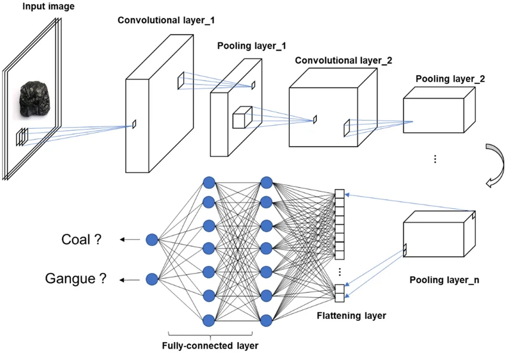
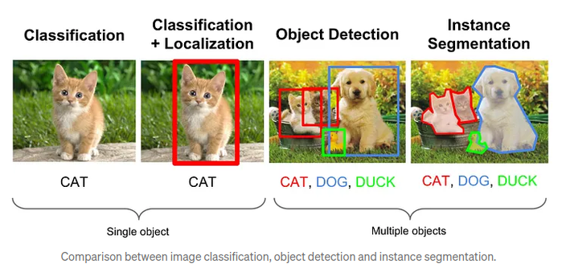
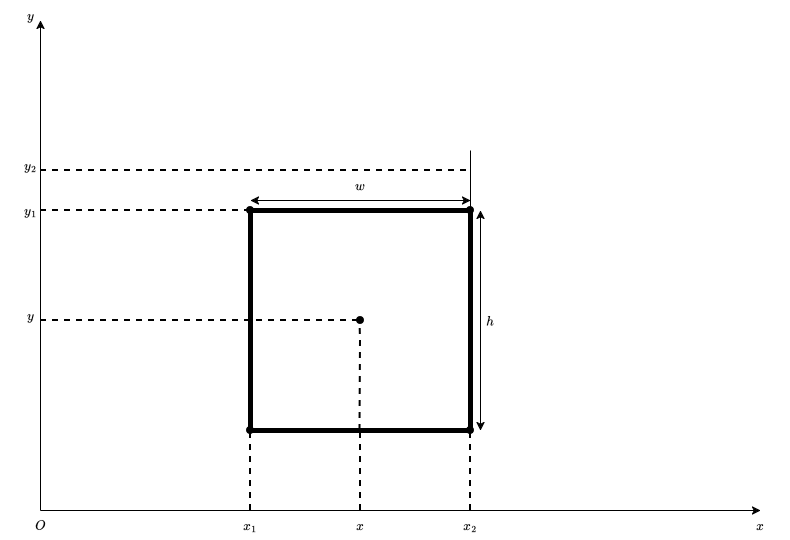
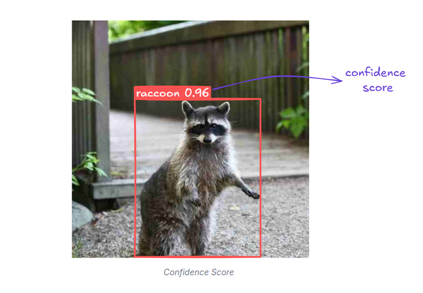
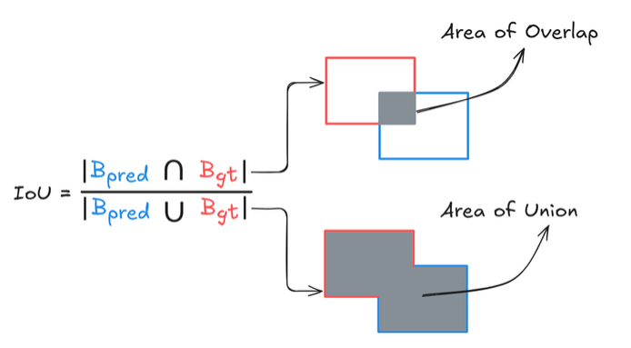
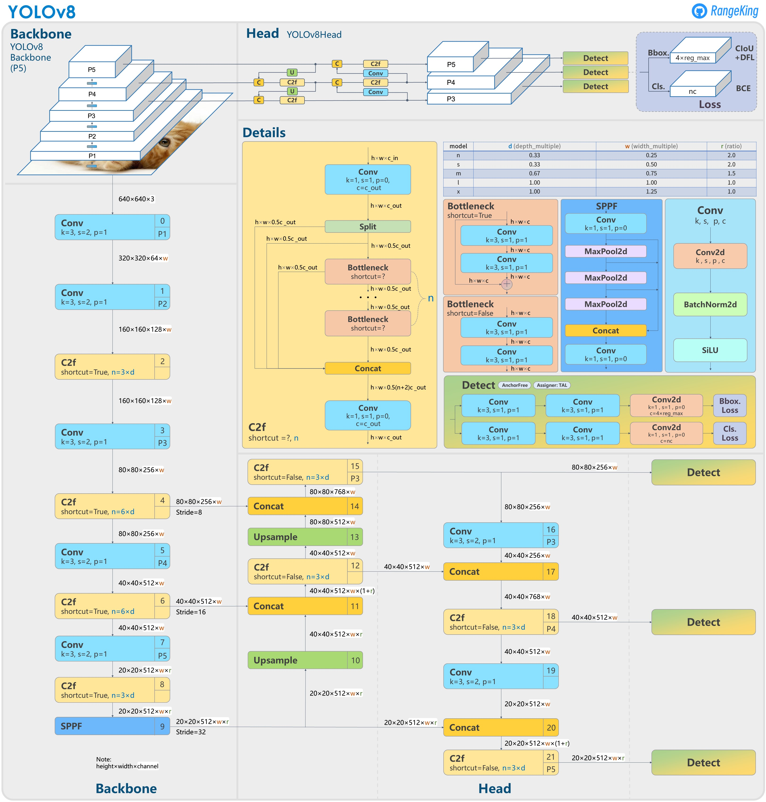
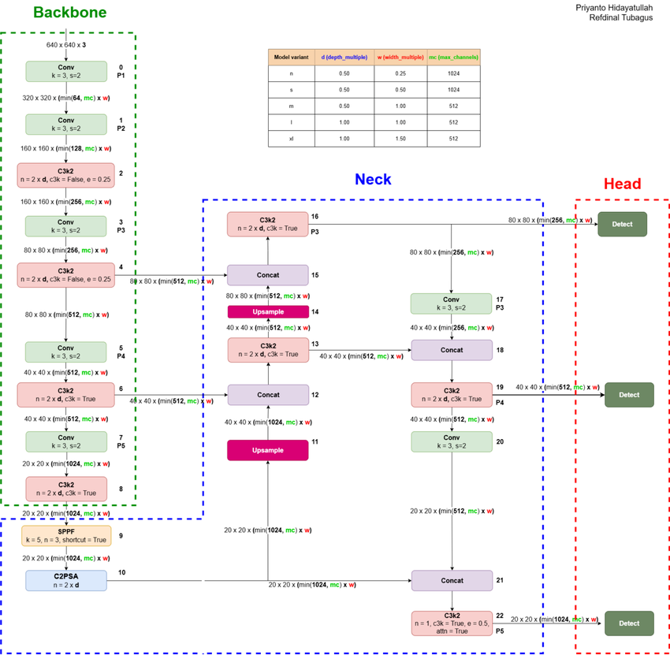

# YOLOv26 – Architectural Overview

## Convolutional Neural Network (CNN)

A Convolutional Neural Network (CNN) is a type of deep learning model designed for processing grid-like data such as digital images. CNNs automatically learn hierarchical features from input images by applying convolutional operations, making them widely used in computer vision tasks such as image classification, object detection, image segmentation, and facial recognition.

### Layers of a CNN

A typical CNN consists of the following layers:

1. **Input layer** – Receives the raw pixel values of the input image.
2. **Convolutional layer** – Applies learnable filters (kernels) to extract spatial features such as edges, textures, and shapes.
3. **Activation layer** – Applies a non-linear activation function, such as Rectified Linear Unit (ReLU), allowing the network to learn complex patterns.
4. **Pooling layer** – Reduces the spatial dimensions of feature maps while preserving the most important information, improving computational efficiency and reducing overfitting.
5. **Flatten layer** – Converts multidimensional feature maps into a one-dimensional feature vector for processing by fully connected layers (primarily in traditional CNN architectures).
6. **Fully connected layer** – Combines the extracted features to perform classification or regression tasks.
7. **Output layer** – Produces the final prediction, such as class probabilities or numerical values.

### How a CNN Works

* **Input layer:** Receives the raw pixel values of an input image.
* **Convolutional layer:** Applies multiple learnable filters across the input image to generate feature maps. Each filter performs element-wise multiplication with the corresponding input region, and the results are summed to detect specific visual features.
* **Activation function (ReLU):** Introduces non-linearity by replacing negative values with zero while retaining positive values, enabling the network to model complex relationships.
* **Pooling layer:** Reduces the spatial dimensions of the feature maps by summarizing information within local regions. Common pooling methods include **max pooling**, which selects the maximum value, and **average pooling**, which computes the average value within each pooling window.
* **Additional convolutional and pooling layers:** Multiple convolutional and pooling layers are stacked to progressively learn increasingly complex features. Early layers capture low-level features such as edges and textures, while deeper layers learn higher-level semantic features such as object parts and complete objects.
* **Flatten layer:** Converts the multidimensional feature maps into a one-dimensional feature vector for subsequent processing.
* **Fully connected layer:** Integrates the extracted features and maps them to the desired output classes or regression values.
* **Output layer:** Produces the final prediction, such as object classes, probabilities, or continuous values, depending on the application.
* **Loss function:** Measures the difference between the predicted output and the ground-truth labels. Common loss functions include cross-entropy loss for classification tasks and mean squared error (MSE) for regression tasks.
* **Backpropagation:** Computes the gradients of the loss function with respect to the network parameters and propagates them backward through the network. These gradients are used to update the weights and biases during training.
* **Training:** The CNN learns by repeatedly performing forward propagation, computing the loss, backpropagating the gradients, and updating the model parameters until the network converges or reaches the specified number of training epochs.
* **Inference:** Once training is complete, the trained CNN processes unseen input images to generate predictions without updating its parameters.

### Feature Extraction

Feature extraction is the process of identifying and learning meaningful patterns from input data that can be used for subsequent tasks such as image classification, object detection, and image segmentation. In traditional computer vision, feature extraction relied on manually designed algorithms to detect edges, corners, textures, and shapes. In contrast, Convolutional Neural Networks (CNNs) automatically learn these features directly from training data, eliminating the need for handcrafted feature descriptors.

Within a CNN, feature extraction is performed by a series of convolutional layers that apply learnable filters to the input image. Each filter responds to specific visual characteristics, producing feature maps that emphasize important patterns while suppressing irrelevant information. During training, these filters are continuously updated through backpropagation, enabling the network to learn the most discriminative features for a given task.

Feature extraction in CNNs follows a hierarchical learning process. The early convolutional layers detect low-level features such as edges, corners, lines, and simple textures. As the network becomes deeper, intermediate layers combine these low-level features to recognize more complex structures, including shapes, contours, and object parts. Finally, the deepest layers learn high-level semantic features that represent complete objects or meaningful visual concepts. This hierarchical representation allows CNNs to distinguish between different object categories even when objects vary in size, orientation, illumination, or background.

The extracted feature maps serve as the foundation for subsequent stages of the neural network. Depending on the application, these features may be used for image classification, object detection, image segmentation, or other computer vision tasks. In object detection models such as the YOLO family, the extracted feature maps are passed to feature fusion and detection modules, where they are used to predict object locations and class labels.

## CV: Computer Vision

Computer vision is a field of artificial intelligence that focuses on enabling machines to interpret and understand visual information from images and videos. Depending on the objective, different tasks are defined within computer vision, each varying in complexity and the type of output produced. The most common tasks include image classification, object localization, object detection, and image segmentation.

### Image Classification

Image classification is the simplest fundamental task in computer vision. It involves assigning a single label to an entire image based on its visual content. The model outputs only the category of the dominant object or scene without providing any spatial information about where the object appears. For example, an image containing a dog would be classified simply as “dog” regardless of its position in the image.

### Object Localization

Object localization extends image classification by not only identifying the object class but also determining its spatial position within the image. In this task, it is assumed that the image contains a single primary object of interest. The model predicts both the class label and a bounding box that defines the location of the object.

The bounding box is typically represented using coordinates that describe its position and size, such as the center point with width and height. Object localization is commonly used in applications where only one dominant object is present per image.

### Object Detection

Object detection generalizes object localization by allowing multiple objects to be identified and located within a single image. In addition to predicting bounding boxes, the model assigns a class label and confidence score to each detected object. This enables the system to recognize multiple objects simultaneously, even when they overlap or appear at different scales.

Object detection is widely used in real-world applications such as autonomous driving, surveillance systems, industrial inspection, and robotics, where understanding both the identity and location of multiple objects is essential.

### Image Segmentation

Image segmentation is a more detailed computer vision task that assigns a class label to each individual pixel in an image. Unlike object detection, which uses rectangular bounding boxes, segmentation provides precise pixel-level boundaries of objects.

Segmentation can be categorized into semantic segmentation, where each pixel is assigned a class label regardless of object instances, and instance segmentation, where each individual object is separated and labeled independently.

### Relationship Between Tasks

These computer vision tasks can be viewed as increasing levels of complexity in visual understanding:

* **Image classification** determines what is present in an image.
* **Object localization** determines what is present and where a single object is located.
* **Object detection** identifies and locates multiple objects in an image.
* **Image segmentation** provides pixel-level classification for precise object boundaries.

Among these tasks, object detection offers a balance between computational efficiency and spatial accuracy, making it suitable for real-time applications. This is why many modern systems, including the YOLO family of models, are designed based on object detection principles.

## Object Detection

Object detection is a computer vision task that identifies and locates objects within an image or video. Unlike image classification, which predicts a single class for an entire image, object detection simultaneously determines the class of each object and its spatial location using bounding boxes.

Each detected object is represented using:

* A bounding box indicating its position in the image
* A class label representing the object category
* A confidence score indicating prediction reliability

Object detection plays an important role in real-world applications such as autonomous driving, surveillance systems, industrial inspection, robotics, and medical imaging, where both object identity and location are required for decision-making.

### Detection pipeline

A typical object detection system follows a structured pipeline that converts raw image data into final predictions.

* **Input Preprocessing:** The input image is resized to a fixed resolution and normalized to ensure consistent input distribution for the neural network.
* **Feature Extraction:** The image is processed by a convolutional neural network (CNN), which extracts hierarchical feature representations. These features encode edges, textures, shapes, and semantic information.
* **Prediction Stage:** The detection model processes feature maps to predict bounding boxes, objectness scores, and class probabilities.
* **Post-processing:**  The raw predictions are filtered using confidence thresholds and duplicate removal techniques such as Non-Maximum Suppression (NMS).

This pipeline enables object detectors to transform visual information into structured outputs that can be interpreted by downstream systems.

### Bounding Box

A bounding box defines the spatial location of an object in an image. It is typically parameterized as:

$$b=(x,y,w,h)$$

where:

* $x,y$: center coordinates
* $w,h$: width and height

Alternative representations include corner-based coordinates:

$$(x_{1}, y_{1}, x_{2}, y_{2})$$

Bounding box regression is a key learning objective in object detection, where the model learns to minimize the difference between predicted and ground-truth boxes.

### Confidence score and objectness

The confidence score represents the probability that a predicted bounding box contains an object.

In modern detectors, this is often decomposed into:

$$Confidence-score = P(Object) \cdot IoU_{pred, gt}$$

where:

* $P(Object)$ is the probability of the object presence
* $IoU$ measures localization quality

This formulation ensures that both classification certainty and localization accuracy influence the final score.

### Class Probability

For each predicted bounding box, the model outputs a probability distribution over all predefined classes:

$$P(class_{i}|object)$$

The final class is selected using:

$$c = arg[maxP(class)]$$

This enables multi-class recognition within a single image.

### Intersection over Union (IoU)

Intersection over Union (IoU) is a geometric metric used to evaluate overlap between two bounding boxes:

$$IoU = \frac{B_{pred} \cap B_{gt}}{B_{pred} \cup B_{gt}}$$

IoU is fundamental in object detection because it is used for:

* Evaluation of localization accuracy
* Matching predictions with ground truth during training
* Filtering overlapping predictions during inference

Higher IoU values indicate better alignment.

### Non-Maximum Suppression (NMS)

Object detection models often produce multiple overlapping predictions for the same object. NMS is used to select the most accurate prediction.

**Algorithm:**

1. Sort predictions by confidence score
2. Select the highest-scoring box
3. Remove all boxes with IoU greater than a threshold
4. Repeat until no boxes remain

This ensures each object is represented by a single final detection.

## YOLO Architecture

YOLO (You Only Look Once) is a single-stage object detection framework that performs detection in a single forward pass of the network.

Unlike two-stage detectors (e.g., R-CNN family), YOLO does not generate region proposals. Instead, it performs dense prediction directly on feature maps, significantly improving speed while maintaining competitive accuracy.

The core idea of YOLO is:

> “Treat object detection as a regression problem.”

### One-Stage Detection

In one-stage detectors, prediction is performed directly from feature maps without intermediate region proposal steps.

* **Advantages:**
  * Low latency
  * End-to-end optimization
  * Suitable for real-time applications
* **Trade-off:**
  * Historically lower accuracy than two-stage methods (now largely reduced in modern YOLO versions)

### Backbone Network

The backbone is responsible for extracting discriminative features from the input image.

It progressively transforms the image into feature representations:

$$I \rightarrow F_{1} \rightarrow F_{2} \rightarrow F_{3}$$

Where:

* Early layers capture edges and textures
* Middle layers capture shapes and parts
* Deep layers capture semantic object representations

The backbone is critical because detection quality is directly dependent on feature richness.

### Neck (Feature Aggregation Module)

The neck enhances feature representation by combining information from different backbone stages.

This is necessary because:

* Deep layers have strong semantics but weak spatial resolution
* Shallow layers have strong spatial detail but weak semantics

The neck solves this trade-off using feature fusion strategies such as:

* Top-down pathways (FPN)
* Bottom-up enhancement (PAN)

This allows the model to retain both localization precision and semantic understanding.

### Detection Head

The detection head converts fused feature maps into final predictions.

For each spatial location, it predicts:

* Bounding box coordinates
* Objectness score
* Class probabilities

Unlike classification networks, the detection head operates on dense grid-based predictions, enabling multiple objects per image.

### Multi-scale Predition

YOLO performs detection at multiple feature scales to handle objects of different sizes.

Let:

* $F_{small}$ detect small objects
* $F_{medium}$ detect medium objects
* $F_{large}$ detect large objects

This multi-scale design significantly improves robustness in complex scenes.

## YOLOv26

YOLOv26 is an improved iteration of the YOLO family designed to enhance accuracy, efficiency, and feature representation while maintaining real-time performance.

It follows the standard YOLO pipeline:

$$Input \rightarrow Backbone \rightarrow Neck \rightarrow Head \rightarrow Pose-processing$$

### Architectural Improvement

YOLOv26 improves feature learning through:

* More efficient convolutional blocks
* Better gradient flow in deep layers
* Enhanced feature fusion strategies in the neck

These improvements increase both detection accuracy and convergence stability during training.

### New Modules

Depending on implementation, YOLOv26 may introduce:

* Optimized convolutional units
* Attention-based feature refinement
* Lightweight feature aggregation blocks

These modules aim to improve performance without significantly increasing computational cost.

### Loss Function

YOLOv26 optimizes a combined loss function:

$$L = L_{box} + L_{cls} + L_{obj}$$

where:

* $L_{box}$ is the bounding box regression loss
* $L_{cls}$ is the classification loss
* $L_{obj}$ is the objectness loss

This multi-component loss ensures balanced learning between localization and classification.

### Training Strategy

Training involves optimizing model parameters using backpropagation over large-scale datasets.

Key techniques include:

* Data augmentation (scaling, flipping, mosaic)
* Learning rate scheduling
* Multi-scale training
* Gradient-based optimization (SGD/Adam variants)

These techniques improve generalization and robustness across diverse input conditions.